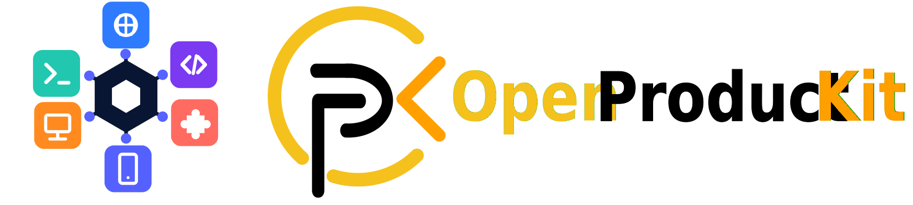

# OpenProductKit

<p align="center">
  
</p>

<p align="center">
  <strong>A white-label product template for shipping commercial apps across web, CLI and desktop from one decoupled core.</strong>
</p>

<p align="center">
  <a href="https://github.com/ravipurohit1991/OpenProductKit/actions/workflows/ci.yml"></a>
  <a href="https://github.com/ravipurohit1991/OpenProductKit/actions/workflows/docs.yml"></a>
  <a href="LICENSE"></a>
  <a href="https://www.python.org"></a>
  <a href="https://copier.readthedocs.io"></a>
</p>

OpenProductKit is a [Copier](https://copier.readthedocs.io) template that gives you a runnable, rebrandable, extensible product repository. Generate it, answer a few questions, and start from a working app with plugins, licensing, generated clients, docs, tests and CI already wired in.

The key idea is simple: **business logic lives in a framework-free core**. Web, CLI and desktop are delivery adapters around that core, not separate implementations of the product.

**Docs:** [openproductkit docs](https://ravipurohit1991.github.io/OpenProductKit/) | [quickstart](docs/quickstart.md) | [architecture](docs/architecture.md) | [make it yours](docs/replace-the-demo.md) | [plugins](docs/plugins.md) | [marketplace](docs/marketplace.md) | [licensing](docs/licensing.md) | [payments](docs/payments.md) | [auth](docs/auth.md) | [deployment](docs/deployment.md) | [deploy recipes](docs/deploy-recipes.md) | [releases](docs/releases.md) | [roadmap](docs/roadmap.md)

**Brand assets:** [banner](docs/assets/brand/openproductkit-banner.svg) | [wordmark](docs/assets/brand/openproductkit-logo.svg) | [favicon](docs/assets/brand/openproductkit-favicon.svg)

---

## Why OpenProductKit?

Most templates get you a web app or a desktop shell. OpenProductKit is meant for product builders who need the same core product to show up in more than one place.

- **One core, many adapters:** pure Python domain logic with FastAPI, Typer, React and desktop surfaces around it.
- **Desktop without a sidecar:** the web UI runs in a native window and calls the app in-process, with no hidden HTTP server or port race.
- **Commercial hooks included:** signed offline license tokens, file/HTTP providers, vendor commands and route/UI gates.
- **Plugin-ready:** Python entry-point plugins can add backend routes, CLI commands, settings, health checks and admin UI.
- **A marketplace, not just plugins:** a catalog tab where users install extensions and unlock paid ones with a license token — live, no restart.
- **Hosted-ready auth:** flip `APP_AUTH_ENABLED=true` and the same build grows accounts, sessions and admin gates; desktop/local stays accountless.
- **Payments are a recipe away:** documented Stripe / Lemon Squeezy / Paddle flows turn checkout into license tokens with ~100 lines.
- **One-command deploy:** `stack up` runs nginx + backend (+ PostgreSQL) in Docker; `stack share` puts a public Cloudflare URL on your dev stack.
- **Release CI included:** push a version tag and GitHub Actions builds desktop installers for all three OSes onto a GitHub Release.
- **Generated typed client:** frontend API types come from the backend OpenAPI schema, with a CI drift gate.
- **Agent-ready rework path:** the demo domain is fenced with `[demo]` markers, and generated projects include `AGENTS.md` and `CLAUDE.md`.

## Quickstart

```bash
# Generate a product from GitHub.
uvx copier copy gh:ravipurohit1991/OpenProductKit my-product

# Or generate from a local clone.
uvx copier copy . ../my-product

cd my-product

# Install the Python workspace.
uv sync --dev

# Smoke test the generated CLI.
uv run opk hello
uv run opk doctor

# Run the backend.
uv run opk dev

# Run the rich web UI in another terminal.
pnpm install
pnpm -C apps/frontend dev
```

The backend starts on `http://127.0.0.1:8000`; the Vite frontend starts on `http://127.0.0.1:5173`.

To run the desktop app:

```bash
uv run opk build web
uv run opk desktop
```

If you changed `cli_name` during generation, replace `opk` with your generated command name.

## What You Get

| Area | Included |
| --- | --- |
| Core | Framework-free Python domain package with models, ports, services and tests |
| Backend | FastAPI, SQLModel persistence, Alembic migrations and OpenAPI |
| CLI | Typer command surface for dev, DB, builds, docs, plugins, licensing and the Docker stack |
| Frontend | React + Vite UI over generated TypeScript API types |
| Desktop | Your pick of **pywebview** (in-process), **Electron** or **Tauri** (sidecar) — one CLI surface for all |
| Licensing | Dev stub, signed offline tokens, file provider, HTTP provider and feature gates |
| Plugins | Entry-point plugin SDK with backend, CLI, settings, health and license support |
| Marketplace | Catalog + unlock-with-token flow: users see, install and unlock paid extensions |
| Auth | Optional user accounts (runtime switch), sessions, first-run admin setup, Users admin tab and CLI |
| Deployment | `stack up` Docker stack (nginx + backend + optional PostgreSQL), `stack share` Cloudflare tunnel, host recipes |
| Releases | Tag-triggered CI building per-OS desktop installers onto GitHub Releases |
| Docs | MkDocs Material site with GitHub Pages and Read the Docs config |
| CI | Linux and Windows checks for backend, frontend and generated project behavior |

## Architecture

```text
packages/core        Pure Python. Domain models + repository ports. No FastAPI, DB or HTTP.
packages/plugin-api  Extension SDK: Plugin contract + entry-point registry.
packages/licensing   Entitlement: dev stub, signed offline tokens, file/HTTP providers.
apps/backend         FastAPI adapter. Owns SQLModel persistence and Alembic migrations.
apps/cli             Typer CLI and project control plane.
apps/frontend        React + Vite UI over a generated OpenAPI client.
apps/desktop*        Your chosen shell: pywebview (in-process) or Electron/Tauri (sidecar).
extensions/          Example plugins: basic, CLI, paid/license-gated, on-demand marketplace demo.
marketplace/         catalog.json for the Marketplace tab.
```

The rule that keeps the template portable:

> Business logic never leaks into FastAPI, Typer or React. Those are delivery mechanisms.

## Make It Your Product

The generated Resource Vault demo is a worked example, not the product. It exists so you can see how one small domain flows through every layer.

Every demo line is marked:

```bash
grep -rn "\[demo\]" packages apps
```

Replace that demo with your product layer by layer using the [Make it yours](docs/replace-the-demo.md) recipe. You can also hand the job to a coding agent: generated projects include an `AGENTS.md` rendered with your project names and the replacement rules.

## Proof It Works

[Tally](https://github.com/ravipurohit1991/tally-time-tracker), a freelancer time tracker, was generated from this template and reworked by an AI agent following `AGENTS.md`.

Its history is intentionally readable: first commit is pristine template output; later commits replace the demo one layer at a time. The [introductory blog post](docs/blog/introducing-openproductkit.md) walks through the approach.

## Roadmap Snapshot

OpenProductKit and generated packages are currently versioned as **0.1.0**. A `v1.0` tag will come after the surface has proven stable in real projects.

Shipped:

- Hexagonal core, FastAPI backend, Typer CLI, React UI and CI
- Resource Vault demo through core, backend, CLI, web and desktop
- Generated OpenAPI TypeScript client
- Plugin manager and example plugins
- Signed offline licensing and HTTP license provider
- Desktop shell of your choice: pywebview (in-process), Electron or Tauri (sidecar)
- Marketplace: extension catalog + unlock-with-license-token, applied without restart
- One-command Docker stack (nginx + backend + optional PostgreSQL) and `stack share` Cloudflare quick tunnel
- Agent-ready rework path with `[demo]` markers and generated agent instructions
- MkDocs Material docs site

Next:

- Payments hook recipe (checkout webhook → `license issue` → email token)
- Runtime plugin installation from the UI, sandboxing and permissions
- Frozen desktop plugin packaging, auto-update and release CI
- Generated-client drift gate in CI

See the [roadmap](docs/roadmap.md) for details.

## Documentation

Build or preview the docs locally:

```bash
uvx --with-requirements requirements-docs.txt mkdocs serve
uvx --with-requirements requirements-docs.txt mkdocs build --strict
```

The published site is available at [ravipurohit1991.github.io/OpenProductKit](https://ravipurohit1991.github.io/OpenProductKit/).

## License

MIT - see [LICENSE](LICENSE).
