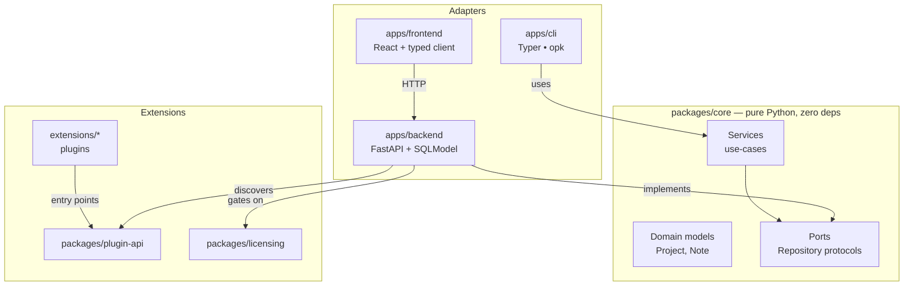

# Architecture

The single rule that keeps this template honest: **business logic never leaks into FastAPI, Typer, or React.** Those are delivery mechanisms. Swap any of them without touching the core.

## The layers

| Layer | Responsibility | Depends on |
| --- | --- | --- |
| `packages/core` | Domain models, `Repository` ports, services. No I/O. | nothing |
| `packages/plugin-api` | The `Plugin` contract + registry. | nothing (runtime) |
| `packages/licensing` | Entitlement abstraction. | nothing |
| `apps/backend` | FastAPI HTTP adapter; owns SQLModel persistence + Alembic. | core, plugin-api, licensing |
| `apps/cli` | Typer CLI, task runner and control plane (`opk`). | core, backend, plugin-api, licensing |
| `apps/frontend` | React + Vite web UI over a generated typed client. | backend (HTTP) |
| `extensions/*` | Example plugins. | plugin-api (+ backend for the paid one) |

## Why hexagonal here

Because the whole selling point is "one product, many faces". `core` is decoupled from **both** HTTP and the database:

- The backend maps domain models to SQLModel rows in `adapters/db` — the core never sees a table.
- The CLI builds the same services against the same repositories.
- Core tests run with an in-memory fake repository — no database, no FastAPI, no network.

If the core weren't decoupled from HTTP *and* persistence, the template wouldn't prove its own thesis.
