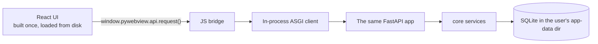

# Desktop

The desktop app is the hexagonal thesis cashed in: **the same product in a
native window, with the core called in-process. No HTTP server, no port, no
sidecar process.**

## How it works



- [pywebview](https://pywebview.flowrl.com/) opens a native window (Edge
  WebView2 on Windows, WKWebView on macOS, GTK/Qt on Linux) on the **same web
  build** the browser gets.
- The typed client detects it is running from `file://` and swaps its `fetch`
  for a bridge call. Every request is dispatched to the FastAPI app **in the
  same process** through an in-process ASGI client — routes, plugins, license
  gates and migrations all behave identically to the web app.
- Data lives in the platform's per-user app-data directory (via
  `platformdirs`), not the working directory; the license file too.

Why not a sidecar? Bundling a second FastAPI process next to a shell means
port races, orphaned processes, firewall prompts and two binaries to sign.
Calling the core in-process deletes that whole failure class — which is only
possible because the core never assumed HTTP in the first place.

## Running and packaging

```bash
opk build web        # once, or after UI changes
opk desktop          # native window, dev mode
opk desktop --check  # headless smoke test: boot + in-process /api/health
opk build desktop    # PyInstaller onedir bundle into ./dist/<project>/
```

The bundle ships the web build and the Alembic migrations as data files; first
launch creates and migrates the user's database automatically.

!!! warning "Code signing is documented, not solved"
    The bundle is unsigned. macOS Gatekeeper and Windows SmartScreen will warn
    users until you sign/notarize with your own certificates (`signtool` /
    `codesign` + `notarytool`). This is a per-vendor, per-OS commercial process
    that a template cannot do for you — budget for it before shipping.

!!! note "Plugins in frozen builds"
    Dev-time plugin discovery uses Python entry-point metadata, which PyInstaller
    does not bundle by default. The packaged desktop app runs the core product;
    shipping plugins inside frozen bundles (via `--copy-metadata`) is a
    roadmap item.
