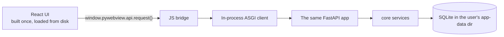
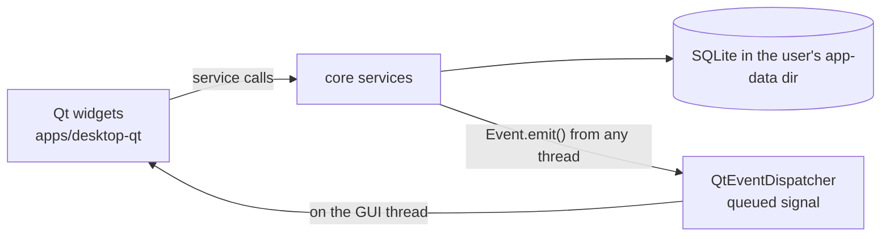
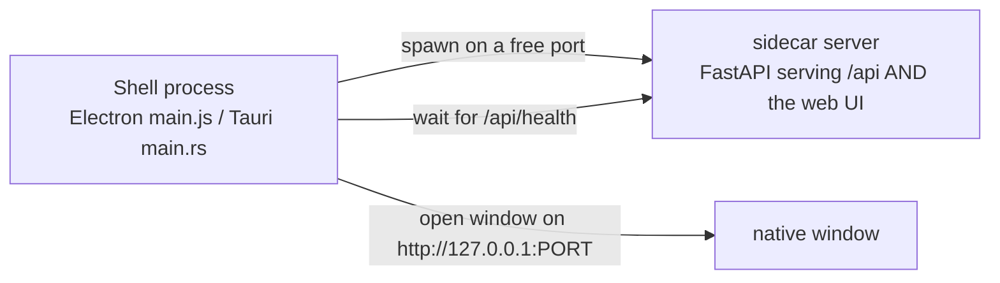

# Desktop

A Copier question picks the desktop shell — the CLI surface stays identical
(`opk desktop`, `opk desktop --check`, `opk build desktop`) whichever you
choose. The three web-view shells render the React UI byte-for-byte from the
same web build; **PySide6** is different in kind — native Qt widgets and no web
view at all.

| | pywebview (default) | PySide6 | Electron | Tauri |
| --- | --- | --- | --- | --- |
| Architecture | core called **in-process**, no server at all | core called **in-process**, no server, no web view | sidecar backend on localhost | sidecar backend on localhost |
| UI | the React web build | native Qt widgets | the React web build | the React web build |
| Runtime | the OS webview | Qt | bundled Chromium | the OS webview |
| Extra toolchain | none | none (pip-installed Qt) | none | Rust (rustup) |
| Bundle size | small | large (Qt) | largest | smallest |
| Packaging | PyInstaller | PyInstaller | PyInstaller sidecar + electron-builder | PyInstaller sidecar + `tauri build` |

Pick **pywebview** unless you have a concrete reason not to: it is the lightest
to build and the purest expression of the hexagonal core. Pick **PySide6** when
the product *is* a desktop tool — data-heavy or scientific UIs (plots, 3D,
custom canvases via pyqtgraph/VTK) where a browser engine is dead weight; it
also lets you skip the web frontend entirely (`include_web_frontend=false`).
Pick **Electron** if you want the Chromium-everywhere rendering guarantee and
its mature ecosystem (auto-update, deep OS integrations). Pick **Tauri** for
the smallest installers if the Rust toolchain doesn't scare you.

## pywebview — in-process, no server



- [pywebview](https://pywebview.flowrl.com/) opens a native window (Edge
  WebView2 on Windows, WKWebView on macOS, GTK/Qt on Linux) on the **same web
  build** the browser gets.
- The typed client detects it is running from `file://` and swaps its `fetch`
  for a bridge call. Every request is dispatched to the FastAPI app **in the
  same process** — routes, plugins, license gates and migrations all behave
  identically to the web app.
- No socket, no port, no sidecar to babysit or sign separately — possible
  because the core never assumed HTTP in the first place.

## PySide6 — native Qt widgets, no web view



- Widgets call the same core services the API and CLI use, through short-lived
  sessions — no HTTP, no web build, one process.
- The decoupling contract runs through `packages/core`'s **event bus**
  (`events.py`): services emit `Event`s; at startup the shell installs a
  `QtEventDispatcher` (a queued Qt signal) so handlers land on the GUI thread.
  Headless — CLI, tests, server — there is no dispatcher and delivery is
  synchronous. The core never imports Qt.
- `opk desktop --check` boots the core + database without ever importing
  PySide6, so CI smoke-tests the desktop wiring on display-less runners.
- Replacing Qt with React (or anything else) later is additive: the FastAPI
  backend is already generated and serving the same services.

## Electron & Tauri — a window over a sidecar



Both shells follow the same contract, implemented in ~100 lines each:

1. pick a free localhost port,
2. spawn the **sidecar server** (`apps/desktop-electron/server.py` or
   `apps/desktop-tauri/server.py` — the FastAPI backend, which also serves the
   built web UI at `/`),
3. wait until it is healthy,
4. open the window on `http://127.0.0.1:<port>/` — one origin, so there is
   **no CORS, no `file://` quirks, no custom protocol**,
5. kill the sidecar on exit.

In dev the sidecar runs from source through `uv`; packaged builds run a
PyInstaller bundle of it (Electron: `extraResources`; Tauri: an external
binary next to the app executable). Data still lives in the platform's
per-user app-data directory, license file included.

## Running and packaging

```bash
opk build web        # once, or after UI changes (web-view shells only)
opk desktop          # native window, dev mode
opk desktop --check  # headless smoke test (PySide6: never imports Qt)
opk build desktop    # installer/bundle into ./dist
```

Per framework, `build desktop` runs:

- **pywebview** — PyInstaller onedir bundle (web build + migrations as data files).
- **PySide6** — PyInstaller onedir bundle (migrations as data files; no web build).
- **Electron** — PyInstaller server bundle, then `electron-builder` (output in
  `dist/electron`).
- **Tauri** — PyInstaller onefile server, copied to
  `src-tauri/binaries/server-<target-triple>`, then `tauri build --config
  src-tauri/tauri.bundle.conf.json`. Replace the placeholder icons with
  `pnpm -C apps/desktop-tauri tauri icon your-icon.png` before shipping.

!!! warning "Code signing is documented, not solved"
    Bundles are unsigned. macOS Gatekeeper and Windows SmartScreen will warn
    users until you sign/notarize with your own certificates (`signtool` /
    `codesign` + `notarytool`). This is a per-vendor, per-OS commercial process
    that a template cannot do for you — budget for it before shipping.

!!! note "Plugins in frozen builds"
    Dev-time plugin discovery uses Python entry-point metadata, which PyInstaller
    does not bundle by default. The packaged desktop app runs the core product;
    shipping plugins inside frozen bundles (via `--copy-metadata`) is a
    roadmap item.
