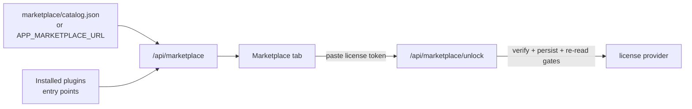

# Marketplace

Every generated product ships a **Marketplace tab**: one place where users see
which extensions exist, which are installed, which are locked behind a plan —
and where they paste a license token to unlock the paid ones. It turns the
plugin system + licensing into something you can actually sell with.



## What the user sees

Each card shows the extension's name, plan requirement and live state:

- **installed · enabled** — running now; toggle on/off instantly.
- **locked** — installed but requires a higher plan; the unlock box at the top
  accepts a signed license token and applies it **immediately, no restart**
  (plugin routes are license-checked per-request).
- **not installed** — offered by the catalog. If the item carries a `package`
  and the deployment allows it, the card shows an **Install** button;
  otherwise it shows the manual command (`uv add <package>`), a homepage link,
  and its plan requirement.

The same information is available headless: `opk marketplace list`,
`opk marketplace unlock <token>` and `opk marketplace install <id>`.

## The catalog

`marketplace/catalog.json` lists what you offer beyond what is installed:

```json
{
  "items": [
    {
      "id": "example.reports",
      "name": "Reports (Pro)",
      "version": "0.1.0",
      "description": "Summary reports over your data.",
      "required_plan": "pro",
      "homepage": "https://example.com/extensions/reports",
      "install_hint": "uv add acme-plugin-reports",
      "package": "acme-plugin-reports==0.1.0"
    }
  ]
}
```

Host that file anywhere and set `APP_MARKETPLACE_URL` to manage your catalog
**without shipping app updates**. Installed plugins are always discovered from
entry points regardless of the catalog, so the tab never lies about local state.

The generated project demonstrates the full loop out of the box:
`extensions/example-marketplace-plugin` lives in the repo but is **not**
installed by `uv sync` — it appears as *not installed* in the tab (with a demo
`package` pointing at the local directory), and once installed it stays
*locked* until a `pro` license token is activated.

## Runtime installs (opt-in)

When a catalog item has a `package` (any pip requirement — a PyPI pin, a
private index name, a local path) the app can install it **while running**:
`POST /api/marketplace/install` pip-installs into the app's environment,
re-scans entry points and mounts the new plugin's routes live. The Install
button appears only when the server says it is actually possible.

This is deliberately fenced:

- **Off by default.** `APP_MARKETPLACE_ALLOW_INSTALL=true` turns it on;
  installing runs the package's code in your app process, so only enable it
  where the catalog is vendor-controlled — never for user-supplied URLs.
- **Admin-only** on deployments with [auth](auth.md) enabled.
- **Refused in frozen desktop builds** — there is no site-packages to install
  into; bundle extensions at build time instead (`opk build desktop` carries
  every installed plugin, metadata included, into the PyInstaller bundle).

Durability depends on how the environment is managed: in a `uv`-synced dev
workspace the next `uv sync` prunes anything not in `pyproject.toml` (use
`uv add` there — the `install_hint`); in a Docker container the install
lives until the container is recreated. The operator-side equivalent is
`opk marketplace install <id>`, which works regardless of the setting.

## Unlocking is licensing, not payments

`POST /api/marketplace/unlock` verifies the pasted token offline against your
vendor public key, persists it to the license file, and clears the resolved
provider so every `require_plan` / `require_feature` gate and plugin route sees
the new entitlements on the next request.

You sell however you like (website, email, invoice); your side of the flow is:

```bash
opk license keygen                      # once — keep the private key secret
opk license issue --licensee "Acme" --plan pro --days 365
# send the printed token to the customer; they paste it in the Marketplace tab
```

Connecting a payment provider is a webhook that calls `license issue` and
emails the token — see [Payments](payments.md) for complete Stripe, Lemon
Squeezy and Paddle recipes.
